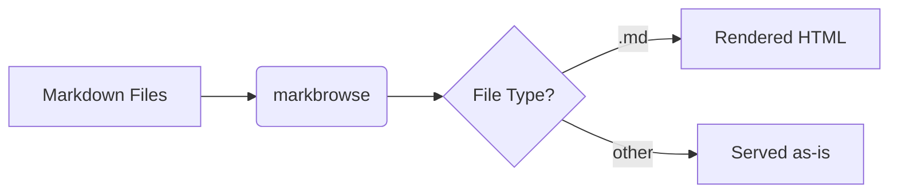

# Getting Started

A quick guide to markbrowse features.

## Mermaid Diagrams

## Admonition Callouts

> [!NOTE]
> Useful for highlighting information.

> [!TIP]
> Helpful suggestions for the reader.

> [!IMPORTANT]
> Key information that should not be skipped.

> [!WARNING]
> Cautionary advice about potential pitfalls.

> [!CAUTION]
> Strong warning about possible negative consequences.

## Wiki Links

Link to other pages with `[[filename]]` syntax:

- [[notes]] links to the notes page
- [[README]] links to the main readme
- Fragment links work too: [[notes#warning]]
